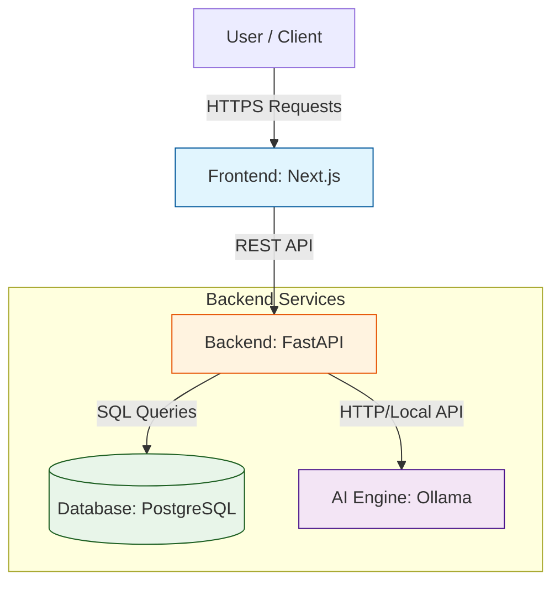

System Architecture Diagram:

    

Components Descriptions:

(Frontend) Next.js: 

Handles user interactions, renders the real-time equipment availability dashboard, and provides the mobile-responsive camera interface to capture photos of the physical sign-out sheets.

(Backend) FastAPI: 

Serves as the central API gateway. It receives image uploads from the frontend, orchestrates the OCR extraction with Ollama, validates the resulting data, and updates the PostgreSQL database.

(Local AI) Ollama: 

Utilized as a multimodal/vision engine (e.g., running a model like LLaVA) to process images of handwritten logs and extract structured JSON data (Who, What, Where, When).

(Database) PostgreSQL: 

Stores the central state of the application, including the Equipment_Status table, Location_Directory, and Checkout_History logs.

Data Flow Schematic:

Diagram
    U as User
    FE as Next.js
    BE as FastAPI
    AI as Ollama
    DB as PostgreSQL

    U->>FE: Enters "I am free Thursday Nights"
    FE->>BE: POST /parse-schedule
    BE->>AI: Prompt: "Convert text to JSON"
    AI-->>BE: Returns { "Thursday": "19:00-23:59" }
    BE->>DB: Insert into Schedules table
    DB-->>BE: Success
    BE-->>FE: 200 OK (Schedule Updated)
    FE-->>U: Shows updated calendar grid

ADRs (Architectural Decision Records):

ADR 001: Local Vision LLM vs Cloud API

Status: Accepted

Context: We need to parse images of handwritten medical logs into structured data. Because these logs exist in a hospital environment and may inadvertently capture sensitive information in the background, sending images to a paid cloud API (like OpenAI) presents budget and potential privacy risks.

Decision: We will utilize Ollama running locally to host a multimodal vision model.

Consequences: The LLM used for this project will require a machine with sufficient RAM and VRAM to process images locally within our target response time.

ADR 002: Backend Framework Selection

Status: Accepted

Context: A backend is required to handle image file uploads from the client, interface with the local vision LLM, and update the database. Options include Spring Boot, FastAPI, Django, etc.

Decision: FastAPI will be utilized.

Consequences: The team has to understand Python type hinting, handling multipart/form-data for image uploads, and defining Pydantic models to strictly validate the JSON output returning from Ollama.

